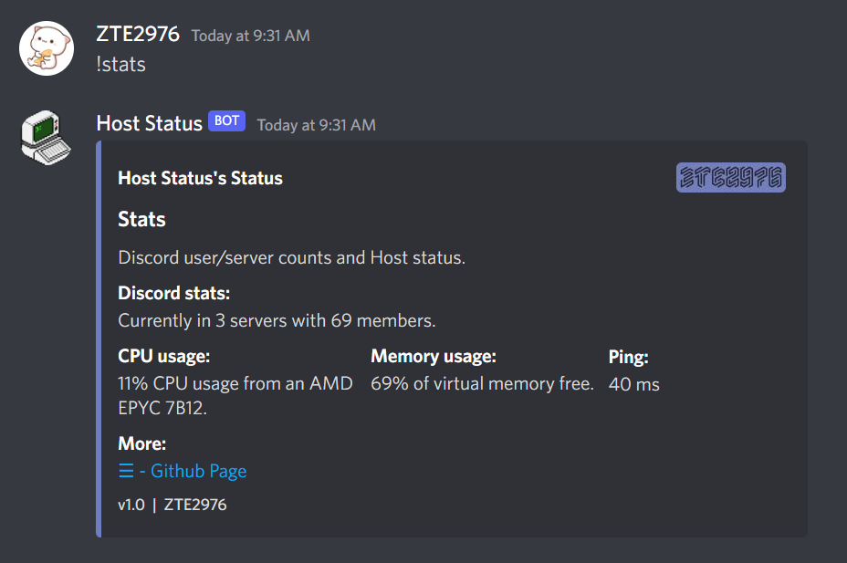

# Discord.py Host Task Manager
  <h3 align="center">Discord.py Host Task Manager</h3>

  

    View your hosts CPU and Ram usage through Discord.
     
  

 
 
 
[[Run on Repl.it]](https://replit.com/@zte2976exe/discordpy-task-manager)

<!-- TABLE OF CONTENTS -->

  
Table of Contents

  <ol>
    <li>
      <a href="#about-the-project">About The Project</a>
      <ul>
      </ul>
    </li>
    <li>
      <a href="#requirements">Requirements</a>
      <ul>
      </ul>
    </li>
    <li>
      <a href="#modules">Python Modules</a>
      <ul>
      </ul>
    </li>
    <li>
      <a href="#why-does-this-exist">Why does this exist?</a>
      <ul>
      </ul>
    </li>
    <li>
      <a href="#other-notes">Other Notes</a>
      <ul>
      </ul>
    </li>
  </ol>

<!-- ABOUT THE PROJECT -->
## About The Project

This allows you to view your hosts CPU and Ram usage using a single command in Discord.

<!-- REQUIRMENTS -->
## Requirements

[Python3](https://www.python.org/)

<!-- MODULES -->
## Python Modules

[discord.py](https://github.com/Rapptz/discord.py)

[py-cpuinfo](https://github.com/workhorsy/py-cpuinfo)

[py-cpuutilization](https://github.com/workhorsylegacy/py-cpuutilization)

[psutil](https://github.com/giampaolo/psutil)

<!-- WHY DOES THIS EXIST -->
## Why does this exist?

I made this so I can monitor my server from anywhere using Discord.

<!-- NOTES -->
## Other Notes

* Feel free to edit this to your liking.
* To add your bots token make an environment variable (.env) with the key as "TOKEN" and the value as your bots token.
